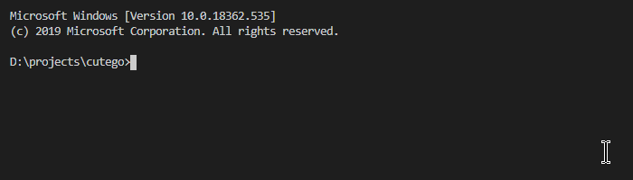
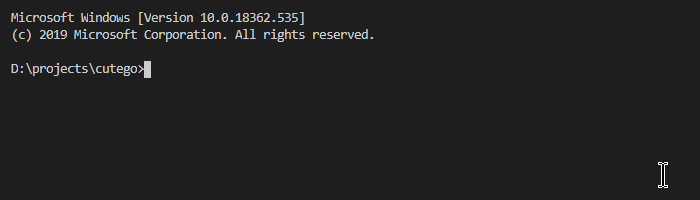
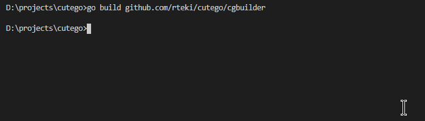
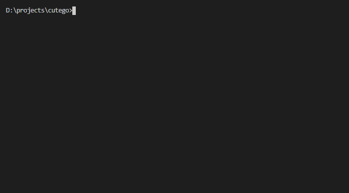
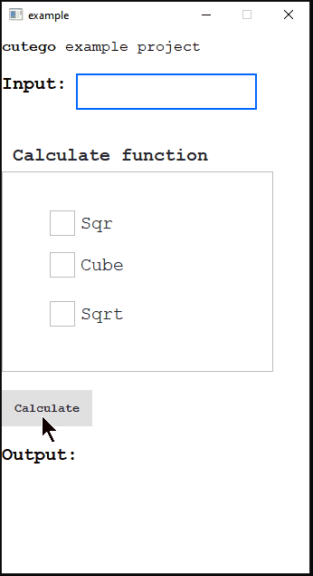

# cutego v0.20
QML support for Golang
## Tested version combinations
- Windows: 
  - **Qt5.13.1 x64 (mingw) + Go1.13.3 x64**
- Linux: **currently not supported**
## Features
- Display QML application.
- Call QML subscribers from Go side using EventManager.
- Call Go subscribers with parameter of type interface{}, with ability to use type assertion. (according to json.Unmarshal)
- Included **cgbuilder** tool which builds configured projects.
## HOWTO Get package
Just execute the next command in your GOPATH directory:
```powershell
go get github.com/shevby/cutego
```
## HOWTO Build
### Steps
1. Build **cgbuilder** tool executing the next command in your GOPATH directory:
```powershell
go build github.com/shevby/cutego/cgbuilder
```
2. Run **cgbuilder** tool. It will try to detect environment which needed to build your project. **cgbuilder_config.json** will be generated. Please fill empty fields. (See project **Project Example** below)
3. Run **cgbuilder** again to build your project.
## Project Example
1. Get the package from the repository as described in the previous section.

2. Build **cgbuilder** tool as described in the previous section

3. Run **cgbuilder** tool, it will generate **cgbuilder_config.json** file

**cgbuilder_config.json** will be automatically generated. It should be like that:
```json
{
  "//qtPath": "Path to Qt (e.g. C:/Qt/Qt5.13.1/5.13.1/mingw73_64)",
  "qtPath": "C:/Qt/Qt5.13.1/5.13.1/mingw73_64/",

  "//qtToolsPath": "Path to Qt Tools (e.g. C:/Qt/Qt5.13.1/Tools/mingw730_64)",
  "qtToolsPath": "C:/Qt/Qt5.13.1/Tools/mingw730_64",

  "//goRootPath": "Path to Go (e.g. C:/Go)",
  "goRootPath": "C:/Go",


  "//tmpDirPath": "Path to intermediate Qt directory",
  "tmpDirPath": "",

  "//qrcRoot": "Path to QML resources root",
  "qrcRoot": "",

  "//mainGoName": "Name of main package entry",
  "mainGoName": "",

  "//buildDest": "Path to the build output",
  "buildDest": ""
}
```
4. Fill the empty values or values which were detected incorrectly. For **example project** the configuration should be like that:
```json
{
  "//qtPath": "Path to Qt (e.g. C:/Qt/Qt5.13.1/5.13.1/mingw73_64)",
  "qtPath": "C:/Qt/Qt5.13.1/5.13.1/mingw73_64/",

  "//qtToolsPath": "Path to Qt Tools (e.g. C:/Qt/Qt5.13.1/Tools/mingw730_64)",
  "qtToolsPath": "C:/Qt/Qt5.13.1/Tools/mingw730_64",

  "//goRootPath": "Path to Go (e.g. C:/Go)",
  "goRootPath": "C:/Go",


  "//tmpDirPath": "Path to intermediate Qt directory",
  "tmpDirPath": "qt_tmp",

  "//qrcRoot": "Path to QML resources root",
  "qrcRoot": "src/github.com/shevby/cutego/example/resources",

  "//mainGoName": "Name of main package entry",
  "mainGoName": "github.com/shevby/cutego/example",

  "//buildDest": "Path to the build output",
  "buildDest": "builds/cutego_example"
}
```
5. Run **cgbuilder** again in order to build **example project**.

6. You should find the executable with collected .dlls and resources in **builds/cutego_example** directory.

